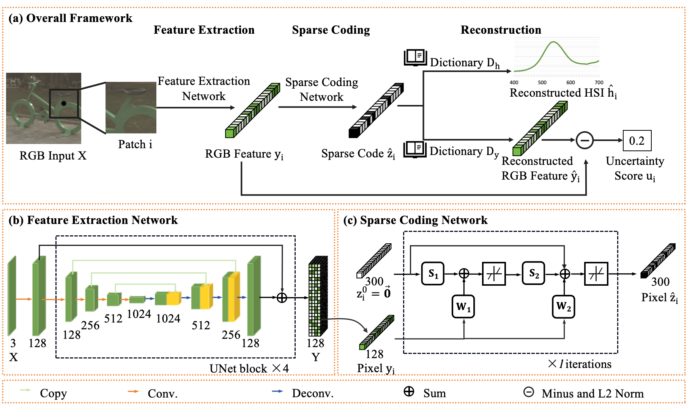
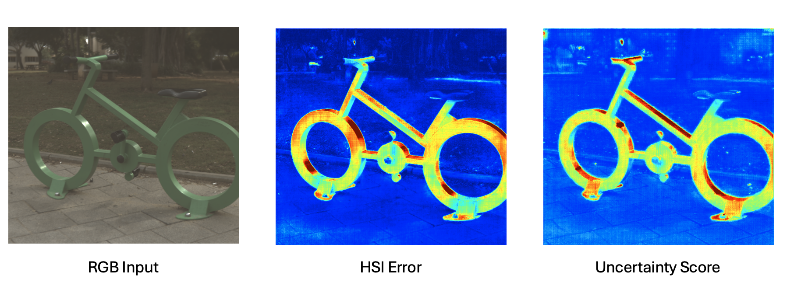

# Uncertainty-Aware Hyperspectral Image Reconstruction from RGB Measurements Using Unrolled Sparse Coding

## Introduction

This repository contains the official implementation of **HSISCN (Hyperspectral Image Sparse Coding Network)**, a deep learning framework designed for hyperspectral image reconstruction from RGB. HSISCN leverages the sparse prior of the spectrums and model the HSI and RGB with coupled dicionaries, which enables the uncertainty prediction of the HSI output.

### Architecture


*Figure 1: Overview of the HSISCN architecture.*

The proposed network consists of feature extraction, sparse coding and reconstruction. The uncertainty is predicted by the reconstruction error of the RGB features, which measures how far is the prediction from the trained sparse model. 
The predicted uncertainty scores and HSI errors are like this:



## Requirements

- Python >= 3.7
- PyTorch >= 1.8.0
- CUDA (for GPU acceleration)
- Additional dependencies listed in `requirements.txt`

## Installation

1. Clone the repository:
```bash
git clone https://github.com/OliveMY/hsi-scn
cd HSISCN
```

2. Install the required dependencies:
```bash
pip install -r requirements.txt
```

## Dataset Preparation

### Data Preprocessing

Since our model assumes the linear degradation model from HSI to RGB, to use our model, you need to first synthesize the degraded RGB images from the hyperspectral ones.
To preprocess your hyperspectral datasets, run:

```bash
python preprocess.py --input_dir /path/to/raw/data --output_dir /path/to/processed/data
```

**Arguments:**
- `--input_dir`: Path to the raw hyperspectral dataset
- `--output_dir`: Path to save the preprocessed data

### Pre-processed Datasets

We provide pre-processed datasets used in our experiments:

- **[ARAD]**: [Download Link - PLACEHOLDER]
- **[ICVL]**: [Coming_up_soon]

Extract the downloaded datasets to the `./preprocessed_data` directory.

## Usage

### Training

To train the HSISCN model from scratch, you need to first setup a config file first, an example is put in the `./configs` folder. Then run:

```bash
python train.py --cfg ./configs/your_config_file
```


### Validation/Testing

To evaluate the trained model on test data, you need the same config file to define the model:

```bash
python validate.py --cfg ./configs/your_config_file --load your_ckpt_path --save ./tmp_output --saveerr hsi_err_path
```

**Key Arguments:**
- `--load`: Path to checkpoint to load
- `--save`: Path to save the visualized uncertainty score and hyperspectral reconstruction error, along with the prediction HSI, default is "None" (Not saving).
- `--saveerr`: Path to save the hyperspectral reconstruction error, default is "None" (Not saving)

We provide pre-trained models for the following configurations:

| Model  | Dataset | PSNR | SSIM | Download |
|-------|---------|------|------|----------|
| HSISCN-ARAD | ARAD | 39.24 dB | 0.9874 | [Link - PLACEHOLDER] |
| HSISCN-ICVL | ICVL | 44.88 dB | 0.9960 | [Link - PLACEHOLDER] |

Download the pre-trained models and place them in the `./checkpoints` directory.

<!-- ### Visual Comparisons


*Figure 2: Visual comparison of super-resolution results.* -->

## Citation

If you find this work useful for your research, please cite our paper:

```bibtex
@inproceedings{ma2025hyperspectral,
  title={Hyperspectral Image Reconstruction with Unseen Material Detection},
  author={Ma, Ye and Lin, Songnan and Wen, Bihan},
  booktitle={ICASSP 2025-2025 IEEE International Conference on Acoustics, Speech and Signal Processing (ICASSP)},
  pages={1--5},
  year={2025},
  organization={IEEE}
}
```

## License

This project is licensed under the MIT License - see the [LICENSE](LICENSE) file for details.

<!-- ## Acknowledgments

We thank [acknowledgments, funding sources, etc.]. -->

## TODO

- [ ] Upload the preprocessed data
- [ ] Upload the pre-trained model

## Contact

For questions or issues, please contact:
- **Name**: Ma Ye
- **Email**: ye.ma@ntu.edu.sg
- **GitHub Issues**: [https://github.com/OliveMY/hsi-scn/issues](https://github.com/OliveMY/hsi-scn/issues)
